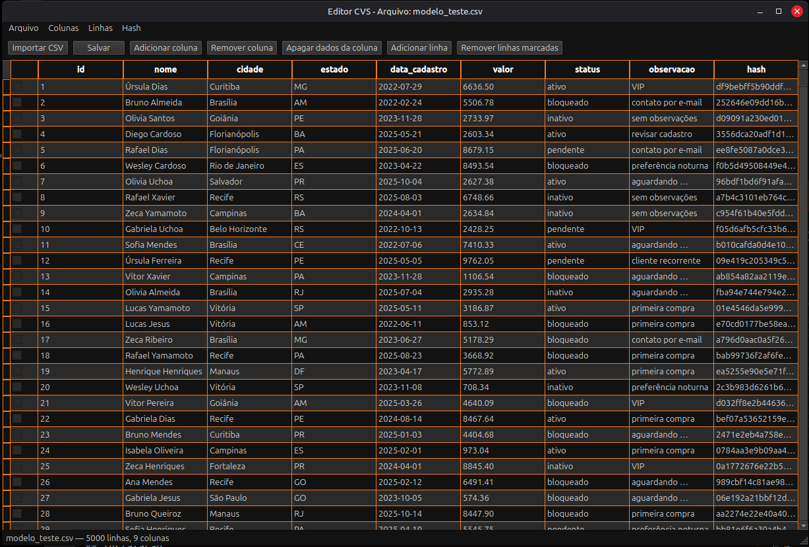

# Editor CSV

Aplicativo desktop para visualizar e editar arquivos CSV, com interface gráfica construída em **PySide6** (Qt for Python).

Tema escuro com laranja, preto, cinza escuro e cinza claro.



## Funcionalidades

- **Abrir CSV** — por diálogo de arquivo, arrastar e soltar ou argumento na linha de comando
- **Criar CSV** — define os nomes das colunas e salva um arquivo novo
- **Edição inline** — altere células e cabeçalhos diretamente na tabela
- **Linhas** — adicionar linhas e remover linhas marcadas com checkbox
- **Colunas** — adicionar, remover ou apagar todos os dados de uma coluna
- **Transformações de texto** — caixa baixa, caixa alta e inicial maiúscula (dados ou títulos)
- **Detecção de delimitador** — reconhece automaticamente `,`, `;`, tab e `|`
- **Controle de alterações** — aviso ao fechar ou abrir outro arquivo com mudanças não salvas
- **Hash bcrypt** — criar hash, buscar um hash nas células do CSV e testar senhas de uma wordlist
- **Arquivo de teste** — `modelo_teste.csv` com 5.000 linhas para validar a interface

## Requisitos

- Python 3.10+
- Linux (X11) com a biblioteca `libxcb-cursor0` (exigida pelo Qt 6.5+)

```bash
sudo apt install libxcb-cursor0
```

## Instalação

```bash
git clone https://github.com/Eduardo-Domiciano/CVS-Edit.git
cd CVS-Edit

python3 -m venv .venv
source .venv/bin/activate

pip install -r requirements.txt
```

Dependências: `PySide6` e `bcrypt`.

## Uso

```bash
python main.py
```

Abrir um arquivo diretamente:

```bash
python main.py caminho/para/arquivo.csv
```

Abrir o modelo de teste:

```bash
python main.py modelo_teste.csv
```

### Atalhos de teclado

| Atalho | Ação |
|--------|------|
| `Ctrl+N` | Criar CSV |
| `Ctrl+O` | Abrir CSV |
| `Ctrl+S` | Salvar |
| `Ctrl+Shift+S` | Salvar como |
| `Ctrl+Q` | Sair |

### Menu Hash

| Ação | Descrição |
|------|-----------|
| Criar Hash | Gera um hash bcrypt a partir de uma senha |
| Buscar hash no CSV | Localiza células que contenham o hash informado |
| Brute-force | Testa senhas de uma wordlist contra um hash alvo |

## Estrutura do projeto

O código segue o padrão **MVC**:

```
.
├── main.py                          # Ponto de entrada
├── modelo_teste.csv                 # CSV de exemplo (5.000 linhas)
├── app/
│   ├── constants.py                 # Paleta de cores
│   ├── theme.py                     # Aplicação do tema Fusion
│   ├── controllers/
│   │   └── main_controller.py       # Fluxos da interface e coordenação
│   ├── models/
│   │   └── csv_table_model.py       # Modelo de dados da tabela CSV
│   ├── services/
│   │   └── hash_service.py          # Criação e verificação de hash bcrypt
│   └── views/
│       ├── main_window.py           # Janela principal
│       ├── create_csv_dialog.py     # Diálogo de criação de CSV
│       ├── create_hash_dialog.py    # Diálogo de criação de hash
│       ├── search_hash_dialog.py    # Diálogo de busca de hash
│       ├── brute_force_dialog.py    # Diálogo de teste com wordlist
│       └── widgets/                 # Componentes visuais customizados
├── requirements.txt
└── visualizador-csv.spec            # Configuração PyInstaller
```

## Empacotamento (opcional)

Para gerar um executável com PyInstaller:

```bash
pip install pyinstaller
pyinstaller visualizador-csv.spec
```

O binário será gerado em `dist/visualizador-csv`.

## Licença

Consulte o repositório para informações de licenciamento.
